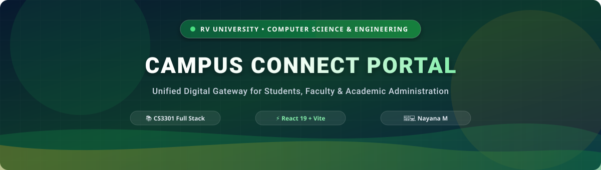

<div align="center">

<!-- Local SVG Animated Banner (100% Uptime & Reliable) -->


<br/>

<!-- Animated Typing Subtitle -->
<a href="https://github.com/Nayana84-m/campus-connect-portal">
  
</a>

<br/><br/>

<!-- Metadata Badges -->
[](https://github.com/Nayana84-m/campus-connect-portal)
[](https://github.com/Nayana84-m)
[](https://rvu.edu.in)
[](https://github.com/Nayana84-m/campus-connect-portal)

<br/>

<p align="center">
  <a href="#-about-the-project">About</a> •
  <a href="#-key-features">Features</a> •
  <a href="#-portal-roles--views">Portal Views</a> •
  <a href="#-tech-stack--tools">Tech Stack</a> •
  <a href="#-project-architecture">Architecture</a> •
  <a href="#-quick-start-guide">Quick Start</a> •
  <a href="#-author">Author</a>
</p>

</div>

---

### 🌐 About the Project

**Campus Connect Portal** is an intuitive, all-in-one digital gateway engineered for the **RV University School of Computer Science & Engineering**. It consolidates daily campus communication, academic resource access, real-time university highlights, and role-based workflows into a unified, high-performance web application.

Designed with clean typography, responsive layout, and modern interactive modules, Campus Connect ensures students, professors, and administrative personnel can seamlessly access services tailored to their daily campus needs.

---

### ✨ Key Features

<table>
  <tr>
    <td width="50%">
      <h4>🏛️ Institutional Branding & Navbar</h4>
      <ul>
        <li>Distinctive RV University brand badge and department identification</li>
        <li>Quick-jump anchors to Login and Student Registration</li>
        <li>Mobile-responsive layout with seamless viewport adaptation</li>
      </ul>
    </td>
    <td width="50%">
      <h4>🌟 Hero Showcase Banner</h4>
      <ul>
        <li>Course identifier badge (<code>CS3301 - Full Stack Development</code>)</li>
        <li>High-contrast campus visual backdrop with smooth text overlay</li>
        <li>Interactive call-to-action to explore role-specific views</li>
      </ul>
    </td>
  </tr>
  <tr>
    <td width="50%">
      <h4>🎞️ Interactive Carousel Slider</h4>
      <ul>
        <li>Showcases campus facilities, learning spaces, and academic tools</li>
        <li>Next & Previous tactile navigation buttons</li>
        <li>Dynamic indicator pills highlighting the active slide</li>
      </ul>
    </td>
    <td width="50%">
      <h4>🔐 React Authentication Module</h4>
      <ul>
        <li>Instant toggle between <b>Student Login</b> and <b>Registration</b></li>
        <li>Reactive form inputs with client-side state handling</li>
        <li>Structured for seamless API integration with backend services</li>
      </ul>
    </td>
  </tr>
</table>

---

### 👥 Portal Roles & Views

<div align="center">

| Role | Target Audience | Key Capabilities |
| :--- | :--- | :--- |
| **👨‍🎓 Student Portal** | Enrolled Undergraduates & Postgraduates | • Browse enrolled course materials<br/>• Track attendance & exam timetables<br/>• View real-time semester grades & notices |
| **👨‍🏫 Faculty Portal** | Teaching & Research Faculty | • Upload syllabus and lecture notes<br/>• Record & review classroom attendance<br/>• Publish academic marks & student feedback |
| **🛡️ Admin Portal** | University Administration | • Manage student & faculty registry<br/>• Broadcast university-wide circulars<br/>• System oversight & analytical reports |

</div>

---

### 🛠️ Tech Stack & Tools

<div align="center">

| Frontend | Styling & Assets | Backend & Tools |
| :---: | :---: | :---: |
|  |  |  |
|  |  |  |
|  |  |  |

</div>

---

### 📁 Project Architecture

```plaintext
campus-connect-portal/
├── assets/                          # Repository documentation visuals & SVGs
│   ├── banner.svg                   # Custom vector animated hero banner
│   └── footer.svg                   # Flowing wave footer divider
├── client/                          # Frontend Application (Vite + React)
│   ├── index.html                   # Primary HTML document & role showcase
│   ├── package.json                 # Frontend dependencies and scripts
│   ├── vite.config.js               # Vite bundler configuration
│   └── src/
│       ├── main.jsx                 # React root bootstrap
│       ├── carousel.js              # Interactive carousel controller logic
│       ├── style.css                # Global stylesheet & design tokens
│       ├── assets/                  # Campus imagery & visual media
│       └── components/
│           └── AuthModule.jsx       # Student login & registration component
├── server/                          # Backend API Architecture
│   ├── package.json                 # Server dependencies & scripts
│   └── src/
│       ├── app.js                   # Application initialization
│       ├── config/                  # Database & environment setups
│       ├── controllers/             # Business logic controllers
│       ├── middleware/              # Auth & error middlewares
│       └── models/                  # Database schemas
├── package.json                     # Root configuration
└── README.md                        # Documentation
```

---

### 🚀 Quick Start Guide

#### Prerequisites
Ensure you have [Node.js](https://nodejs.org/) (v18 or higher) and `npm` installed.

#### Step 1: Clone the Repository
```bash
git clone https://github.com/Nayana84-m/campus-connect-portal.git
cd campus-connect-portal
```

#### Step 2: Install Dependencies
```bash
cd client
npm install
```

#### Step 3: Run the Development Server
```bash
npm run dev
```

#### Step 4: Access the Portal
Open your browser and navigate to:
```
http://localhost:5173
```

---

### 👤 Author

<div align="center">


### **Nayana M**
**RV University** — School of Computer Science & Engineering  
*CS3301 - Full Stack Development*

[](https://github.com/Nayana84-m)
[](mailto:nayanambsc24@rvu.edu.in)

<br/>

<!-- Local SVG Wave Footer -->


<sub>&copy; 2026 RV University • Campus Connect Portal • Designed & Developed by Nayana M</sub>

</div>